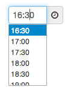

#Prototype.TimePicker

A time picker control for textfields built using Prototype.js. Inspired by Google Calendar.



Ported from Anders Fajerson's [jQuery.timePicker](http://github.com/perifer/timePicker/network) and fixed / completed by [@_PandaJS](https://twitter.com/_PandaJS)

##Examples

Default:

```html
	<input id="time1" type="text">
    <script>new Prototype.TimePicker('time1');</script>
```

02.00 AM - 03.30 PM, 15 minutes steps:

```html
	<input id="time2" type="text">
	<script>
    new Prototype.TimePicker('time2', {
      startTime: "02.00", // Using string. Can take string or Date object.
      endTime: new Date(0, 0, 0, 15, 30, 0), // Using Date object here.
      show24Hours: false,
      separator: '.',
      step: 15,
      onChange: function() {
        console.log('time2 change !');
      }
    });
	</script>
```

More advanced example available in the index.htm file.